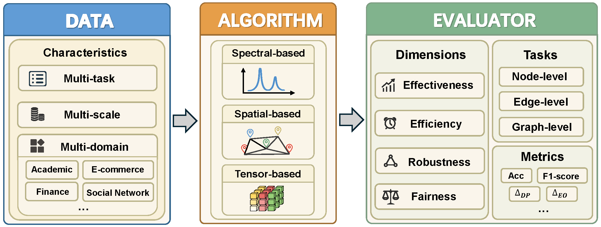

<p align="center">

</p>

------

<p align="center">
  <a href="#overview-of-the-benchmark">Overview of the Benchmark</a> •
  <a href="#installation">Installation</a> •
  <a href="#quick-start">Quick Start</a> •
  <a href="#references">Algorithm References</a> •
  <a href="#citation">Citation</a> 
</p>

# DHG-Bench

DHG-Bench is an open and unified pipline for Deep Hypergraph Learning (DHGL) based on [PyTorch](https://pytorch.org/) and [PyTorch Geometric](https://www.pyg.org/). We embark on **16** state-of-the-art hypergraph neural network (HNN) algorithms in node-level, edge-level, and graph-level tasks and analyze their performance in **20** distinct hypergraph datasets.

## <span id="overview-of-the-benchmark">📔 Overview of the Benchmark</span>

<div align="center">
  
  <p align="center"><em>Figure 1: Pipeline of the DHG-Bench.</em></p>
</div>

## <span id="installation">📦 Installation</span>

## <span id="quick-start">🚀 Quick Start</span>

## <span id="quick-start">🧩 Algorithm References</span>

| **ID** | **Method** | **Paper** |     **Venue**     |  
| :----: | :----: | :----: |:----: |  
|1 | HGNN | [Hypergraph neural networks](https://cdn.aaai.org/ojs/4235/4235-13-7289-1-10-20190705.pdf) | AAAI 2019 | 
|2|HyperGCN|[HyperGCN: A New Method of Training Graph Convolutional Networks on Hypergraphs](https://proceedings.neurips.cc/paper/2019/file/1efa39bcaec6f3900149160693694536-Paper.pdf)|NeurIPS 2019| 
|3| HNHN | [HNHN: Hypergraph Networks with Hyperedge Neurons](https://grlplus.github.io/papers/40.pdf) | ICML WS 2020 | 
|4| HCHA | [Hypergraph convolution and hypergraph attention](https://www.sciencedirect.com/science/article/abs/pii/S0031320320304404?via=ihub) | PR 2020 | 
|5| UniGNN | [UniGNN: a Unified Framework for Graph and Hypergraph Neural Networks](https://www.ijcai.org/proceedings/2021/0353.pdf) | IJCAI 2021 | 
|6| AllSetformer | [You are AllSet: A Multiset Function Framework for Hypergraph Neural Networks](https://openreview.net/forum?id=hpBTIv2uy_E) | ICLR 2022 | 
|7|HyperND|[Nonlinear Feature Diffusion on Hypergraphs](https://proceedings.mlr.press/v162/prokopchik22a/prokopchik22a.pdf)|ICML 2022|
|8| EHNN|[Equivariant hypergraph neural networks](https://arxiv.org/pdf/2208.10428)|ECCV 2022|Y|Y|
|9| LEGCN|[Semi-supervised Hypergraph Node Classification on Hypergraph Line Expansion](https://arxiv.org/pdf/2005.04843)|CIKM 2022|
|10| ED-HNN | [Equivariant Hypergraph Diffusion Neural Operators](https://openreview.net/forum?id=RiTjKoscnNd) | ICLR 2023 | 
|11|PhenomNN|[From Hypergraph Energy Functions to Hypergraph Neural Networks](https://proceedings.mlr.press/v202/wang23d/wang23d.pdf)|ICML 2023|
|12|SheafHyperGNN|[Sheaf Hypergraph Networks](https://proceedings.neurips.cc/paper_files/paper/2023/file/27f243af2887d7f248f518d9b967a882-Paper-Conference.pdf)|NeurIPS 2023|
|13|HJRL|[Hypergraph Joint Representation Learning for Hypervertices and Hyperedges via Cross Expansion](https://openreview.net/forum?id=fxLaL5s6UH)|AAAI 2024|
|14| DPHGNN |[DPHGNN: A Dual Perspective Hypergraph Neural Networks](https://arxiv.org/pdf/2405.16616)|KDD 2024| 
|15|T-HyperGNNs |[T-HyperGNNs: Hypergraph Neural Networks via Tensor Representations](https://ieeexplore.ieee.org/document/10462516)| TNNLS 2024|
|16|TF-HNN |[Training-Free Message Passing for Learning on Hypergraphs](https://openreview.net/pdf?id=4AuyYxt7A2)| ICLR 2025|

## <span id="quick-start">📖 Algorithm References</span>
Our paper on this benchmark has be released!

If you use our benchmark in your works, we would appreciate citations to the paper:

```bibtex

```